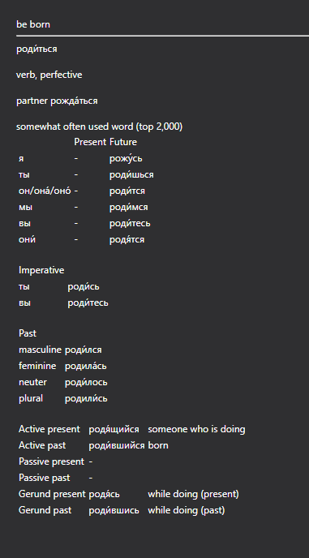

# openrussian_to_anki
Scrape data from openrussian.org and put it into an anki deck

Current status (January, 11th, 2023):
Only verbs - exporting only A2 so it doesn't take an eternity. 
This results in 27 verbs at the moment, which you can download for feedback [here](test.apkg)

TODO:
- Add example sentences
- Other word types, full export will probably be linked via another platform, depending on size
- Formatting, general prettiness will come after that

Current status looks as follows:

